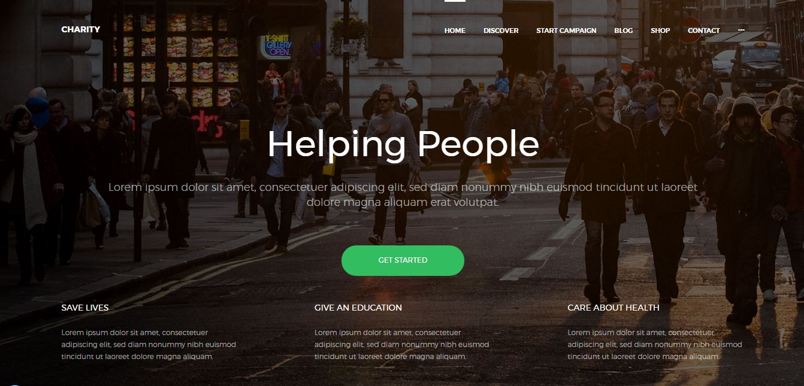
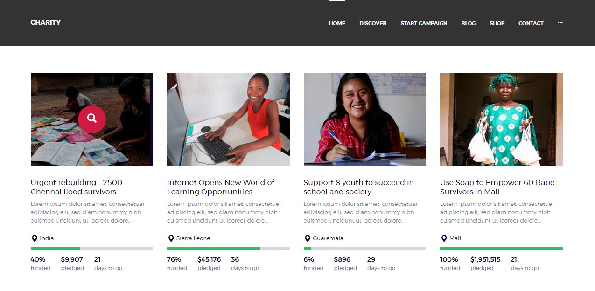
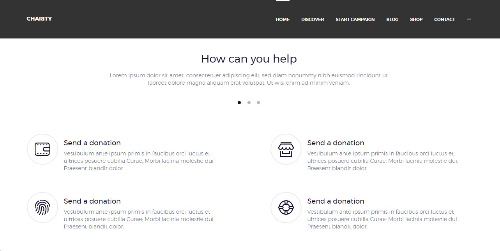
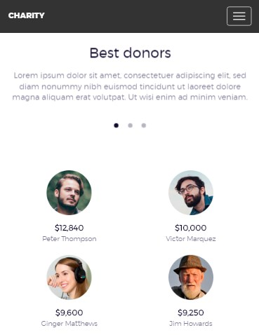

# Responsive Layout: Charity

Charity is a responsive layout based on Bootstrap v3.3.7. The layout is designed for the main (Home) page. This project includes HTML5, CSS3, jQuery and a plugin Lightbox. It uses Gulp for compiling Sass to CSS, watching Sass files for changes, generating a sprite from images.

## Getting Started

* clone this GIT repository
* go to the folder `app` and run `index.html`

## Development

### Required preconditions

* [install](https://howtonode.org/how-to-install-nodejs) Node.js
* install Gulp
    ```
    $ npm install gulp -g
    ```
    
### Deployement steps

* clone this GIT repository
* go to the created folder
* install dependencies
    ```
    $ npm install
    ```

* run gulp
    ```
    $ gulp
    ```

* go to the folder `app` and run `index.html`

## Screenshots of the project





